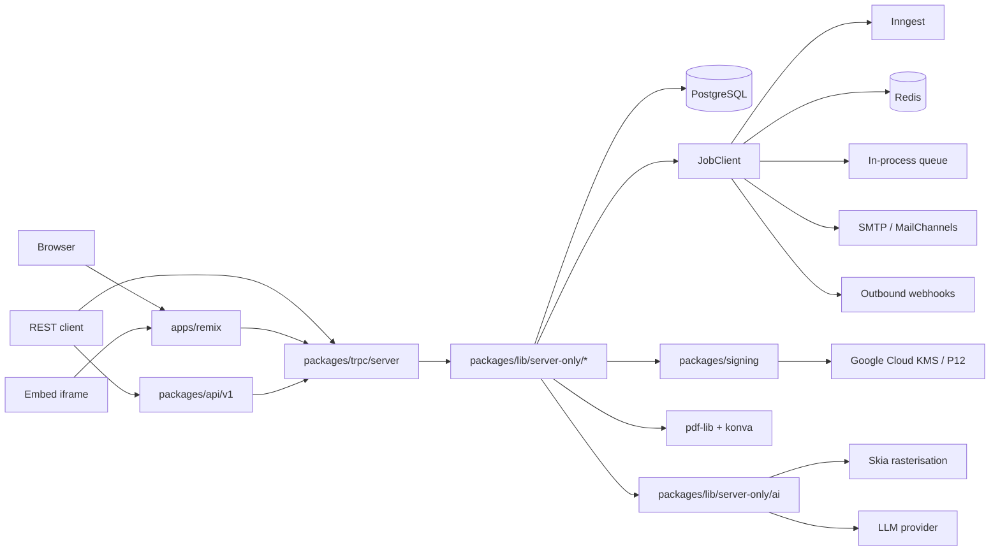

# Architecture Notes

BchatSign is a pnpm monorepo organised around three deployable apps and a constellation of internal `packages/*`. Domain logic lives in `packages/lib` and is consumed by HTTP layers (tRPC, REST, Hono) and the Remix UI. Heavy background work — sealing PDFs, dispatching emails, calling webhooks, running AI — runs through a pluggable job runner. The system is designed so that the Remix app can be replaced or scaled horizontally while the domain core and job runner stay unchanged.

## System Architecture Overview

The system is a **modular monolith** with clear intra-process boundaries. Three web surfaces share one domain core:

- **`apps/remix`** — primary user-facing app (Remix + tRPC + REST under `apps/remix/server/api` and `apps/remix/server/api/files`).
- **`apps/docs`** — MDX docs site with its own search and OG image generation.
- **`apps/openpage-api`** — Hono app for marketing pages and read-only public metrics (GitHub stars, signers, MRR).

All three share the same Prisma client (`packages/prisma`) and the same domain services (`packages/lib/server-only/*`). The signing core (`packages/signing`) is a standalone transport-agnostic library used by the sealing job and by the public REST API. Background work runs through `packages/lib/jobs/client` which can target Inngest, BullMQ, or the in-process `LocalJobProvider`.

Request lifecycle (signing flow):

```
Browser ─► Remix loader/action ─► tRPC router ─► domain service (lib/server-only)
                                                    │
                                                    ├─► Prisma (Postgres)
                                                    └─► JobClient.dispatch(seal-document)
                                                            │
                                                            ▼
                                                       Inngest / BullMQ / Local
                                                            │
                                                            ▼
                                                  PDF sealed, audit log written,
                                                  emails queued, webhooks fired.
```

## Architectural Layers

- **Config**: `packages/tsconfig`, `packages/tailwind-config`, root + per-app `vite.config.ts`, `playwright.config.ts`, `prisma/schema.prisma`.
- **Models**: Prisma schema (`packages/prisma/schema.prisma`) and Zod schemas (`packages/prisma/generated/zod`). Domain DTOs in `packages/lib/types` and `packages/lib/schemas`.
- **Repositories / Domain services**: `packages/lib/server-only/*` — each domain entity (`envelope`, `document`, `recipient`, `field`, `team`, `organisation`, `webhook`, `template`, `folder`, `auth`, etc.) has its own folder with create/update/delete/get helpers. `packages/lib/universal/*` holds code safe on both runtimes.
- **Controllers**:
  - **tRPC** in `packages/trpc/server/*-router/` (envelope, document, recipient, field, folder, team, organisation, template, profile, auth, api-token, admin, enterprise, embedding, webhook).
  - **REST v1** in `packages/api/v1`.
  - **Hono server routes** in `apps/remix/server/router.ts` and `apps/remix/server/api/**`.
  - **Remix loaders/actions** in `apps/remix/app/routes/**` (organised by pathless layout folders: `_authenticated`, `_recipient`, `_share`, `_unauthenticated`, `embed`, `_internal`, `api`).
- **Components**: `packages/ui` (design system), `apps/remix/app/components/**` (feature components), `apps/docs/src/components` (MDX and AI components), `packages/email/template-components`.
- **Jobs**: `packages/lib/jobs/definitions/{internal,emails}/**` — one file per job plus its handler. Triggered from domain services via `JobClient`.
- **Utils**: `packages/lib/utils`, `packages/lib/errors`, `packages/lib/constants`, `packages/lib/client-only/hooks`, `packages/trpc/utils`.

> Use `context({ action: "getMap", section: "all" })` for the generated architecture and dependency summary.

## Detected Design Patterns

| Pattern | Confidence | Locations | Description |
|---------|------------|-----------|-------------|
| Repository / service-per-entity | High | `packages/lib/server-only/{envelope,document,recipient,field,team,organisation,template,folder}/` | Each domain entity exposes typed `createX/getX/updateX/deleteX` functions that own their Prisma calls. |
| Router composition (tRPC) | High | `packages/trpc/server/router.ts`, `packages/trpc/server/*-router/router.ts` | Sub-routers are merged into `AppRouter`; consumers reference `AppRouter['x'][...]`. |
| Pluggable provider | High | `packages/lib/jobs/client/{base,local,bullmq,inngest}.ts`, `packages/lib/universal/upload/providers/*`, `packages/signing/transports/*`, `packages/email/transports/*` | Each subsystem exposes a `Base*Provider` with a `getProvider()` factory keyed on env. |
| Wizard / multi-step flow | High | `packages/ui/primitives/document-flow`, `packages/ui/primitives/template-flow` | Step state machine in `document-flow/types.ts`; each step is a `*FormPartial` component. |
| Token-gated public route | High | `apps/remix/app/routes/_recipient+/*`, `apps/remix/app/routes/_share+/*` | Recipients arrive via signed token URLs; loaders resolve `getDocumentByToken`. |
| PDF stamping pipeline | High | `packages/lib/server-only/pdf/*`, `packages/lib/server-only/htmltopdf`, `packages/signing` | HTML→PDF → field placement → signature → audit log. |
| Audit log + extended status | High | `packages/prisma/types/extended-document-status.ts`, `packages/lib/server-only/document/find-document-audit-logs.ts` | `DocumentStatus` enum extended for derived states; audit log rows per envelope. |
| EE gating | Medium | `packages/ee/server-only/*`, `packages/lib/server-only/license/license-client.ts` | Enterprise features guarded by `LicenseClient` and internal claim IDs. |
| Embedding API surface | Medium | `apps/remix/app/routes/embed+/v1+/{authoring,multisign}`, `packages/trpc/server/embedding-router` | Public iframe-embeddable flows for partners. |
| AI detection pipeline | Medium | `packages/lib/server-only/ai/envelope/{detect-recipients,detect-fields}`, `apps/remix/server/api/ai/*` | PDF→images via Skia, then heuristic + LLM pass to propose fields and recipients. |

## Entry Points

- [apps/remix/server/router.ts](apps/remix/server/router.ts) — Hono router for the main app.
- [apps/remix/app/root.tsx](apps/remix/app/root.tsx) — Remix root document.
- [apps/remix/server/load-context.ts](apps/remix/server/load-context.ts) — request context (auth, prisma, jobs).
- [apps/remix/app/routes/api+/webhook.trigger.ts](apps/remix/app/routes/api+/webhook.trigger.ts) — manual webhook trigger endpoint.
- [apps/remix/app/routes/api+/stripe.webhook.ts](apps/remix/app/routes/api+/stripe.webhook.ts) — Stripe webhook handler.
- [apps/remix/app/routes/_internal+/[__htmltopdf]+](apps/remix/app/routes/_internal+/[__htmltopdf]+) — internal HTML→PDF rendering route used by the sealing job.
- [packages/trpc/server/router.ts](packages/trpc/server/router.ts) — `AppRouter`.
- [packages/api/v1](packages/api/v1) — REST v1 surface.
- [packages/signing/index.ts](packages/signing/index.ts) — `signPdf` library entry.
- [apps/docs/src/app/llms.txt](apps/docs/src/app/llms.txt) — LLM-friendly docs index.
- [apps/openpage-api/app](apps/openpage-api/app) — public metrics API.

## Public API

| Symbol | Type | Location |
|--------|------|----------|
| `AppRouter` | type | `packages/trpc/server/router.ts:36` |
| `createTrpcContext` | function | `packages/trpc/server/context.ts:19` |
| `TrpcContext` | type | `packages/trpc/server/context.ts:70` |
| `signPdf` | function | `packages/signing/index.ts:38` |
| `createLocalSigner` | function | `packages/signing/transports/local.ts:25` |
| `createGoogleCloudSigner` | function | `packages/signing/transports/google-cloud.ts:46` |
| `getTimestampAuthority` | function | `packages/signing/helpers/tsa.ts:23` |
| `S3Provider` | class | `packages/lib/universal/upload/providers/s3-provider.ts:10` |
| `AzureBlobProvider` | class | `packages/lib/universal/upload/providers/azure-blob-provider.ts:15` |
| `InngestJobProvider` | class | `packages/lib/jobs/client/inngest.ts:10` |
| `BullMQJobProvider` | class | `packages/lib/jobs/client/bullmq.ts:32` |
| `LocalJobProvider` | class | `packages/lib/jobs/client/local.ts:40` |
| `JobClient` | class | `packages/lib/jobs/client/client.ts:10` |
| `TelemetryClient` | class | `packages/lib/server-only/telemetry/telemetry-client.ts:25` |
| `LicenseClient` | class | `packages/lib/server-only/license/license-client.ts:26` |
| `AuthClient` | class | `packages/auth/client/index.ts:36` |
| `cn` (class-name helper) | function | `packages/ui/lib/utils.ts:5` |
| `getSigner` (signing selector) | function | `packages/signing/index.ts:20` |
| `seedDatabase` | function | `packages/prisma/seed-database.ts:4` |

## Internal System Boundaries

- **Web ↔ Domain**: UI never touches Prisma directly. Loaders/actions call tRPC, tRPC calls services in `packages/lib/server-only/*`, services own the database.
- **Sync ↔ Async**: user-facing mutations stay in the request lifecycle; sealing, email, webhooks, AI detection and cert generation are dispatched to `JobClient` and run async.
- **App ↔ Workspace**: features are scoped by `userId` or by `teamUrl` (`apps/remix/app/routes/_authenticated+/t.$teamUrl+`). All queries are filtered by `organisationId`/`teamId`/`userId` to enforce tenancy.
- **Embed ↔ Native**: embed routes (`apps/remix/app/routes/embed+/{v1,v2}/...`) use a smaller surface (`embedding-router`, `multisign`) and a different auth handshake.
- **Public REST ↔ Internal**: `packages/api/v1` re-uses tRPC procedures but exposes them under an OpenAPI-flavoured Hono adapter in `packages/trpc/utils/openapi-fetch-handler.ts`.
- **EE / OSS**: code in `packages/ee` is loaded only when the license key validates; the rest of the codebase reads its flags through `LicenseClient`.

## External Service Dependencies

- **PostgreSQL** — primary store, via Prisma. Connection string in `DATABASE_URL`.
- **S3-compatible storage** (AWS S3, MinIO) — PDF assets and uploaded files.
- **Azure Blob** — alternative storage provider.
- **Redis** — required for BullMQ in self-hosted deployments.
- **Inngest** — optional serverless job backend; falls back to BullMQ or Local.
- **SMTP / MailChannels** — outbound email.
- **Stripe** — subscriptions, invoices, customer portal, webhooks.
- **Google Cloud KMS** — optional cloud signing transport.
- **Headless Chromium (`pyppeteer` / Playwright)** — HTML→PDF rendering in `__htmltopdf` route.
- **OpenAI / LLM provider** — optional AI envelope/field detection.

## Key Decisions & Trade-offs

- **Service-per-entity over repository abstraction**: avoids a class-hierarchy tax; each service module is just a set of typed functions. Easy to tree-shake.
- **Pluggable job provider**: lets the same codebase run on Inngest (managed), BullMQ (self-hosted), or Local (dev/CI) without rewriting handlers.
- **Hono + Remix**: Hono handles low-level HTTP, file routing, and webhook endpoints; Remix keeps loader/action ergonomics for the UI surface. They share `load-context`.
- **EE under `packages/ee`**: enterprise code is opt-in via `LicenseClient` so the OSS bundle remains usable without it.
- **Token-based recipient URLs**: every envelope exposes a unique `token` per recipient; loaders resolve identity from the token, not cookies, so external signers don't need an account.
- **Strict TypeScript + Zod everywhere**: domain boundaries validated with Zod (`packages/lib/schemas`, `packages/prisma/generated/zod`); tRPC procedures re-use those schemas.

## Diagrams



## Risks & Constraints

- **Sealing pipeline is CPU/IO heavy** — bursty traffic can saturate headless Chromium; horizontal scaling of the sealing job runner is the primary mitigation.
- **Hono + Remix duality** — easy to forget which surface owns a route; keep new endpoints in the right layer (`_internal` and `api+` are Hono, `_authenticated` is Remix).
- **Token URLs are the auth surface for recipients** — rotating or invalidating them has legal/UX consequences; treat tokens as secrets at rest.
- **Pluggable providers** — when adding a new provider, register the env switch in the corresponding `*Config` and update the `getProvider()` factory.

## Top Directories Snapshot

| Directory | Approx. role |
|-----------|--------------|
| `apps/remix` | Main web app: routes, components, server, tRPC context. |
| `apps/docs` | MDX documentation site. |
| `apps/openpage-api` | Public marketing + metrics API. |
| `packages/lib` | Domain services, utilities, jobs, schemas. |
| `packages/ui` | Design system + document/template flow wizards. |
| `packages/trpc` | tRPC routers and context. |
| `packages/api` | Public REST API (v1). |
| `packages/prisma` | Schema, generated client, Zod models, seeds. |
| `packages/email` | React-Email templates and transports. |
| `packages/signing` | PDF signing library. |
| `packages/auth` | Sessions, passkeys, 2FA. |
| `packages/ee` | Enterprise / paid features. |
| `packages/app-tests` | Playwright e2e suite and fixtures. |
| `scripts` | Repo-level Node scripts. |
| `.context` | Generated codebase map, agents, skills. |

## Related Resources

- [project-overview.md](project-overview.md)
- [data-flow.md](data-flow.md)
- [security.md](security.md)
