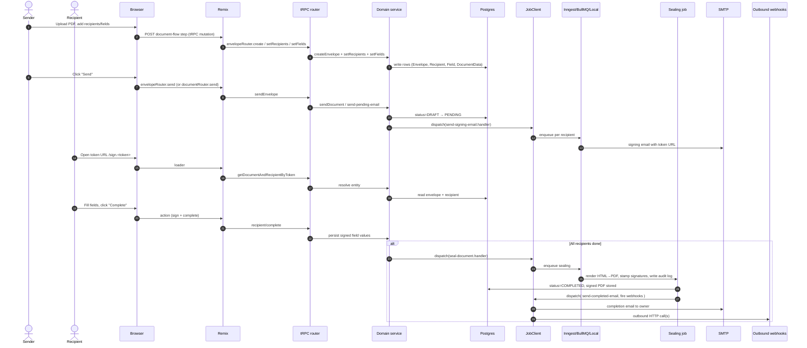

# Data Flow & Integrations

BchatSign's central flow is the **envelope**: a unit of work that takes one or more PDFs through prepare → send → sign → seal → archive. The data plane spans the browser, Remix server, tRPC/REST, domain services, Prisma, the job runner, and several external providers (S3, SMTP, Stripe, Inngest/BullMQ, optionally an LLM). This document traces the canonical envelope flow and lists the cross-module dependencies that other flows (templates, folders, teams, webhooks, embeds) reuse.

## Module Dependencies

- **`apps/remix`** → `packages/trpc`, `packages/lib`, `packages/ui`, `packages/auth`, `packages/email`, `packages/prisma`, `packages/signing`, `packages/ee`.
- **`apps/docs`** → `packages/ui`, `packages/lib` (utilities only).
- **`apps/openpage-api`** → `packages/trpc` (read-only procedures), `packages/lib`.
- **`packages/trpc`** → `packages/lib/server-only/*`, `packages/prisma`, `packages/ee`, `packages/auth`.
- **`packages/lib/server-only/*`** → `packages/prisma`, `packages/lib/jobs`, `packages/lib/universal`, `packages/signing`, `packages/email`, `packages/ee` (only for license-gated paths).
- **`packages/lib/jobs`** → Inngest / BullMQ / Local provider.
- **`packages/email`** → `packages/lib` (transports), `packages/email/templates` → `packages/ui/template-components`.
- **`packages/signing`** → P12 keystore or Google Cloud KMS; TSA via `getTimestampAuthority`.
- **`packages/prisma`** → `packages/lib/types` (re-exports generated DTOs).
- **`packages/ee`** → `packages/lib/server-only/license` (gates).

## Service Layer

The "service layer" is implemented as folders of pure functions under `packages/lib/server-only/<entity>/`. Notable services:

- **Envelope lifecycle**: `envelope/create-envelope.ts`, `envelope/duplicate-envelope.ts`, `envelope/redirect-envelope.ts`, `envelope/seal-envelope.ts`, `envelope/set-envelope-items.ts`.
- **Document flow** (legacy parallel surface): `document/create-document.ts`, `document/send-document.ts`, `document/send-pending-email.ts`, `document/send-delete-email.ts`, `document/delete-document.ts`, `document/get-document-by-token.ts`, `document/find-document-audit-logs.ts`.
- **Templates**: `template/create-document-from-template.ts`, `template/create-document-from-direct-template.ts`, `template/duplicate-template.ts`.
- **Recipients & fields**: `recipient/create-envelope-recipients.ts`, `recipient/update-envelope-recipients.ts`, `field/create-envelope-fields.ts`, `field/update-envelope-fields.ts`.
- **Teams / organisations / folders**: `team/*`, `organisation/*`, `folder/*`.
- **Auth & sessions**: `auth/*` (passkey, 2FA, password reset, magic link).
- **Webhooks**: `webhooks/create-webhook.ts`, `webhooks/trigger/*` (Zapier adapter too).
- **Stripe / EE**: `stripe/*`, `ee/server-only/stripe/webhook`, `ee/server-only/limits`.
- **AI**: `ai/envelope/detect-recipients.ts`, `ai/envelope/detect-fields.ts`, `ai/pdf-to-images.ts`.
- **PDF utilities**: `pdf/add-rejection-stamp-to-pdf.ts`, `pdf/sign-pdf.ts`, `htmltopdf/*`.

## High-level Flow

**Send → sign → seal** (canonical envelope flow):

## Internal Movement

- **Synchronous service calls** for in-request reads and small mutations (add field, change subject, set recipient name).
- **Asynchronous job dispatch** for anything user-visible but expensive:
  - `seal-document.handler.ts` — final PDF sealing, audit log, completion email, webhook fan-out.
  - `send-signing-email.handler.ts` — per-recipient email with tokenised URL.
  - `send-completed-email.handler.ts` — owner notification.
  - `send-cancel-email.handler.ts` — cancel flow.
  - `send-delete-email.handler.ts` — soft-delete notifications.
  - `send-organisation-invitation.handler.ts` — team invites.
  - `webhooks/trigger/*.ts` — outbound webhook delivery with retries and signing.
  - `ai/envelope/detect-{recipients,fields}.handler.ts` — AI proposals on uploaded PDFs.
- **File storage**: PDFs are stored in the configured upload provider; only metadata (storage key, page count, hash) lives in Postgres. The `__htmltopdf` internal route is invoked by the sealing job to render previews/sealed copies.

## External Integrations

- **PostgreSQL (Prisma)** — primary store. Auth: connection string; payloads: schema-validated via Zod; retries: Prisma `interactive-transactions` for multi-step writes.
- **S3 / Azure Blob** — object storage for PDFs. Auth: provider-specific env (`STORAGE_*`); uploads via `S3Provider` / `AzureBlobProvider` with presigned URLs.
- **SMTP / MailChannels** — outbound email. Auth: SMTP creds or MailChannels API key; rate limits enforced by the transport; failures surface as `AppErrorCode.EMAIL_BOUNCED` and roll back the recipient state.
- **Stripe** — subscriptions, invoices, customer portal. Auth: `STRIPE_SECRET_KEY`; webhook handler at `apps/remix/app/routes/api+/stripe.webhook.ts`; events mapped to internal claims via `INTERNAL_CLAIM_ID`.
- **Inngest** — serverless job backend. Auth: signing key + event key; payloads are JSON-serialised job definitions; retries automatic; local dev uses `inngest-cli`.
- **BullMQ** — Redis-backed queue for self-hosted. Auth: Redis URL; payloads via `BaseJobProvider`; retries with backoff configured per job.
- **Google Cloud KMS** — cloud signing transport. Auth: GCP service account; used when `SIGNING_TRANSPORT=google-cloud`.
- **P12** — local signing transport for dev / on-prem. Auth: file path + passphrase in env.
- **TSA (Timestamp Authority)** — RFC 3161 timestamps appended to signatures via `getTimestampAuthority`.
- **LLM provider** (optional) — used by `packages/lib/server-only/ai` for envelope/field detection. Auth: provider API key; failures fall back to manual editing.
- **GitHub API** — used by `apps/openpage-api` to surface star/fork/PR counts on marketing pages.

## Observability & Failure Modes

- **Audit log**: every state transition writes a row via the extended `DocumentStatus` enum; admins see the log in `AdminDocumentLogsTable`.
- **Webhook delivery**: each call is recorded in `WebhookCall` with status (`WebhookCallStatus`); failures retry with exponential backoff and a dead-letter after max attempts.
- **Email delivery**: bounces are surfaced back into the audit log; recipients marked `BOUNCED` are skipped on subsequent attempts.
- **Sealing failures**: captured by `BackgroundTaskFailedError` / `BackgroundTaskExceededRetriesError` in `LocalJobProvider`; the same shape is implemented in Inngest/BullMQ adapters. The job state is exposed in the admin jobs table.
- **Telemetry**: `TelemetryClient` reports optional, opt-in events; disabled in self-hosted OSS builds.
- **License check**: `LicenseClient` validates the EE license key; missing/invalid keys downgrade enterprise features transparently.
- **Rate limiting**: `packages/lib/server-only/rate-limit` guards auth, password reset, and signing endpoints; backed by the chosen provider (in-memory in dev, Redis in prod).

## Related Resources

- [architecture.md](architecture.md) for module boundaries.
- [security.md](security.md) for secrets and audit policies.
